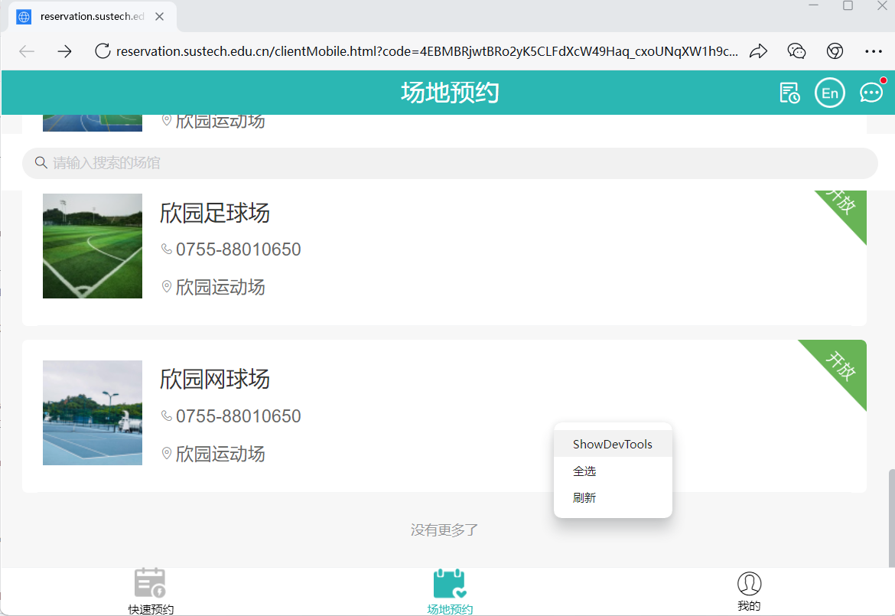

# SUSTech Venue Reserver
该脚本fork from https://github.com/RuixiangJiang/SUSTech-Runyang-Reserve ，我只修改了球场相关配置。
## 预约步骤
1. 打开企业微信，按ctrl+alt+shift+D，进入开发者模式

2. 点击场地预约，右键点击“欣园网球场”。

3. 点击`showDevTools`，再点击`欣园网球场`。

4. 预约一个练习场，找到自己的`clientUid`和`ts`，并填入脚本中的config.json文件中相应位置。

5. 在config.json中填写自己的信息（包括预约时间、学生id、学生名字、学生电话）

6. 每天晚上7点55（每天晚上8点开放7天后的选场），进行前3步，找到你的token(token每5分钟左右会失效，所以最好靠近8点时进行预约)，填入config.json的token中，然后在快到8点前的8~5秒开始运行main.py即可

## 1. Why you should use a reserver

A reservation is typically from a phone or a computer, which launches a browser to complete. It costs much flow rate and higher load for the server. Hence, I developped this tool, pursuing the simplest way to book a ground efficiently and reduce the load on the server side.

It is available at 2025/09/21.

## 2. Requirements

To run the tool, you must have a Python environment. The library requirements are shown in the `requirements.txt`. It's recommended to use Python 3.10, which is the version that I used to develop this tool. Note that other popular Python versions may also be available, as I didn't conduct any version test.

It would be better if you are good at computer networks.

## 3. Theory for a reserver

Originally, the path to make a reservation is:

- curl `https://open.weixin.qq.com/connect/oauth2/authorize?appid=CORPID&redirect_uri=REDIRECT_URI&response_type=code&scope=snsapi_base&state=STATE&agentid=AGENTID#wechat_redirect`
- be redirected to `https://reservation.sustech.edu.cn/clientMobile.html?code=CODE&state=STATE#/reservation/gym`
- get a user token by CODE indicated in the url above
- make a reservation based on the token

### (1) The first try to get access to the reservation system

To manually book a ground, we typically use Wechat or WeCom, then click the reservation button in the SUSTech Vene Reservation app and follow its instructions to complete the task. The first thing is, what happened when we click the "场地预约" button. If you click it, the app will launch a built-in browser, and you should choose a ground to book.

For the built-in browser, you can find a dots button at the top right side. If you click it, you can copy the url of the current page. And the url looks like `https://reservation.sustech.edu.cn/clientMobile.html?code=xxxxxxxxx&state=STATE#/reservation/gym`. However, if you use your default browser like Chrome to open it, you will fail due to the OAuth2 authentication and then be redirected to a new page whose url begins with `open.weixin.qq.com`.

Actually, once you click the "场地预约" button, the browser will open the url `https://open.weixin.qq.com/connect/oauth2/authorize?appid=CORPID&redirect_uri=REDIRECT_URI&response_type=code&scope=snsapi_base&state=STATE&agentid=AGENTID#wechat_redirect`. You can find something interesting through a careful review on the redirected url mentioned in the last paragraph. The url looks like `https://open.weixin.qq.com/connect/oauth2/authorize?appid=wx8839ace7048d181b&redirect_uri=https%3a%2f%2freservation.sustech.edu.cn%2fclientMobile.html%23%2freservation%2fgym&response_type=code&scope=snsapi_base&state=STATE&connect_redirect=1#wechat_redirect`, in which you can find the `appid`, `redirect_uri`, and some other parameters. For more information, please refer to the [document](https://developer.work.weixin.qq.com/document/path/96441) published by WeCom Developer Center.

That means, if you want to open the url in your default browser or in a Python script, you must find all of the required parameters mentioned in the WeCom document. Some parameters are easy to find, for example, we have already known that `CORPID` is `wx8839ace7048d181b` and `REDIRECT_URI` is `https%3a%2f%2freservation.sustech.edu.cn%2fclientMobile.html%23%2freservation%2fgym`. Once you complete all of them and open the completed url, you will be redirected to a link in form of `https://reservation.sustech.edu.cn/clientMobile.html?code=CODE&state=STATE#/reservation/gym`. **However, there is a parameter that I failed to find, `AGENTID`, which made me fail to be redirected. Furthermore, it means I failed to get the `CODE` shown in the redirected url, which would be quite important in the following steps. Basically, the administrators of SUSTech have the power to access it. If anyone is able to find it, please raise an issue, and your efforts will simplify the reserver quite much.**

As I failed to find such a `CODE`, I need to find another way.

### (2) Another way to access

Note that the built-in browser is able to fill the `AGENTID`, thus it is able to be redirected to a url contains a `CODE`. Maybe I can give up finding a `CODE` by myself, and just use the `CODE` indicated in the built-in browser.

Let's focus on what are done during a login to the reservation homepage, i.e., the HTTP requests and the responses. The reservation page uses TLSv1.3 to encrypt, and that means, if you use some tools like WireShark to grab the packets, it will be hard to retrieve the HTTP requests. It's recommended to use WireShark to try it out, then you will have a better understanding of what I wrote.

Hopefully, we can use the developer mode of WeCom to grab the HTTP requests. To enter the developer mode, please open the WeCom app and press Ctrl+Alt+Shift+D in windows or Command+Shift+Control+D in MacOS. The following instructions are based on MacOS, and you can do the same thing in Windows.

In the top bar, please follow the figure below to open the Web element inspection. Then right click the reservation page and choose "Inspect Element". Choose "Network" and "XHR/Fetch".

You will find some requests, like `getAgreement`. Just choose one, and click "Headers" then scroll down to the bottom. There is a token that you should take down. Every request has the same token. If there is no token, just move on to another request. **Note that the token will expire in about 5 minutes, so if you encounter an error named "鉴权失败2", please reload the page and use the new token.**

**Note that this token is very important, and we will use it in the following part.** Please keep in mind that we will encounter a new token in the captcha part, but the two tokens are not the same. I will use `tokenUser` and `tokenCaptcha` to tell them.

### (3) How to make a reservation

Based on the token, you can do anything use a script by sending a request as long as you can provided the right url and data. Note that a request contains three important parts, url, data, and header. To find what requests that you can send, you can click the buttons in the page and focus on the requests list shown in the element inspector window.

For example, we open the page shown below and focus on the `getOrderTimeConfigList` request.

It means, if you send a request with

- url: `https://reservation.sustech.edu.cn/api/blade-app/qywx/getOrderTimeConfigList?groundId=1298272433186332673&startDate=2025-03-01&endDate=2025-03-07&userid=xxxxxxxx&token=xxxxxx`
- method: GET
- data: None
- header: something like `Accept`, `Accept-Encoding`, `Referer` and `User-Agent`

and you will get a response similar to the figure below.

For those requests that have a data field, you can also check Request object tree in the same place.

You just need to write a Python script to send the request and catch the response, then you can print the text of the response and find anything you are interested in.

Now let's take a look at things happened in the procedure of a success reservation. You need to find a available ground and book it manually. Focus on the requests **in the time order**. After I booked a ground, the requests are shown in the figure below (but not in the time order).

Ignore the process you find a free ground and focus on what happened from the time that you are right about to click the book button. A manual reservation process is that you click the book button, pass the captcha verification, then send a reservation request to the backend. Let's see the requests shown in the element inspector. In the table below, I emit the `https://reservation.sustech.edu.cn/api/` to simplify the Url part.

| Request Name |                       Url                       |                      Request Data                      | Response Data |                            Timing                            |             Operation              |
| :----------: | :---------------------------------------------: | :----------------------------------------------------: | :-----------: | :----------------------------------------------------------: | :--------------------------------: |
|     get      |                  `captcha/get`                  |            `captchaType`, `clientUid`, `ts`            |   `repData`   |            Once you enter the page to choose time            |     Ask for a captcha picture      |
|    check     |                 `captcha/check`                 |          `captchaType`, `pointJson`, `token`           |   `repData`   |            Once you finish a captcha verification            | Check if you pass the verification |
|     get      |                  `captcha/get`                  |            `captchaType`, `clientUid`, `ts`            |   `repData`   | Once you finish a captcha verification, the website would ask for a new captcha no matter if you passed or failed |     Ask for a captcha picture      |
|  saveOrder   | `blade-app/qywx/saveOrder?userid=xxx&token=xxx` | `captchaVerification`, `customerId`, `startTime`, etc. |    `data`     |       Once you pass the previous captcha verification        | Send a request to finish the order |

Hence, the idea to book a ground with a Python script is quite simple. You should follow this steps:

-   open a reservation page from your WeCom app and take down the `token` mentioned in (2), and regard it as `tokenUser`
-   send a POST request named get (**note that the request method should be POST but not GET**) with a fine-designed payload data which contains `captchaType`, `clientUid` and `ts`; the `captchaType` is always `blockPuzzle`, as you can find your own `clientUid` and `ts` by clicking the reservation button which will ask for a captcha
-   get the response data of get, and you should take down the `secretKey`, `token`, `jigsawImageBase64` and `originalImageBase64` for future usage; note that I will regard `tokenCaptcha` as the `token` found here
-   find the place that you should put the `jigsawImage` to and return the coordinates of the point
-   send a POST request named check with a data which contains `captchaType`, `pointJson` and `token`; you should find a proper way to convert the coordinates to the `pointJson` and put `tokenCaptcha` here
-   get the response data of check, and you will get `success: true` if you passed the captcha verification 
-   send a POST request named saveOrder with a data which contains many important things like `captchaVerification`; you can refer to my code to identify what you should write in the data, and you should find a way to construct the right `captchaVerification`
-   get the response data of saveOrder, and you will get `success: true` if you booked the ground successfully 

Now the problem is, given the `jigsawImage` and the `originalImage`, how we could find the proper point, pass the verification and get the right `captchaVerification`.

### (4) How to pass the captcha verification 

The main logic is shown in `src/captchaVerification.py`.

You can use `base64.b64decode()` to save the `jigsawImage` and the `originalImage` to your local storage and check the two images. Also, the captcha product is designed by AJ Captcha and published at Gitee, as you can read the [source code](https://gitee.com/anji-plus/captcha/blob/dev/core/captcha/src/main/java/com/anji/captcha/service/impl/BlockPuzzleCaptchaServiceImpl.java) of AJ Captcha to have a better understanding of my solution. For instance, you may be curious about how to use a point to represent the place that the jigsaw image should be in the original image. The source code indicates we should use the top-left point to represent it.

For example, a pair of original and jigsaw images are shown below.

There are exactly three jigsaw holes in the original pictures, and they are polished by Gaussian Blur, and that's why it is hard to use a Computer Vision tool to find the proper place for the jigsaw directly. However, there is a simplier way to solve the problem. Note that in the jigsaw image there is only one part is not transparent. Find the top-left point of the nontransparent part, and we can get the y value of our solution point.

The remaining thing is to find the x value, i.e., match our jigsaw image to one of the jigsaw holes in the original image. It's indicated by the source code that the points around the jigsaws holes will be set to white, which means we can find white areas to find the three jigsaws holes in the original image. Note that the original image may also contain some other white points, so the solution might be wrong. But no worries because we can post a new get request to have another try.

After we find three areas surrounded by white, we extract their top-left points, and compare their y value to our solution point's y value. If there is exactly one match, it indicates we may find a right solution. If it finally turns out that we are wrong, just ask for a new shoot.

Now the problem is to convert the coordinates to `pointJson`. According to the source code, we should set y to 5, then convert the point to a string in the form `{"x":xxx,"y":5}` and finally use `secretKey` to encrypt it use AES. As for AES, there is an [online tool](https://the-x.cn/cryptography/aes.aspx) to encrypt or decrypt a string using a provided key. Now that we have calculated the `pointJson`, we can post a check request and see if our solution is right. If the response contains `success: true`, we can move on to the next step.

The next step is to calcluate `captchaVerification`. According to the source code, we should use AES with `secretKey` to encrypt the string `{tokenCaptcha}---{pointJson}` to get the `captchaVerification`. However, I found that SUSTech reservation system choose `{tokenCaptcha}---{point}` to be encrypted, for example, `tokentokentoken---{"x":xxxxxx,"y":5}`. For more information, please book a ground manually and use the online AES tool to decrypt the `captchaVerification` that you found in your saveOrder request.

Finally, we send a saveOrder request to book a ground. Please refer to my code to find the parameters you should pass in the data part. If the response contains `success: true`, it means your reservation is success.

## 4. How to use my code

Please make sure that you have read part 3 carefully, or you may have a misunderstanding of my code which leads to failure.

To use my code, you only need to modify `config.json`. In detail, you need to change `student_name`, `student_id`, `student_tel`, `start_time`, `end_time` and `captcha_payload` to your own information. Before every 20:00, you should launch a WeCom built-in browser to get the `token`, i.e., `tokenUser`. After that, simply run `main.py` then it will help you to book.

Sometimes you may need to change `open("config.json", "r", encoding='utf-8')` to `open("../config.json", "r", encoding='utf-8')` in `Load_json.py` to make it work properly.
